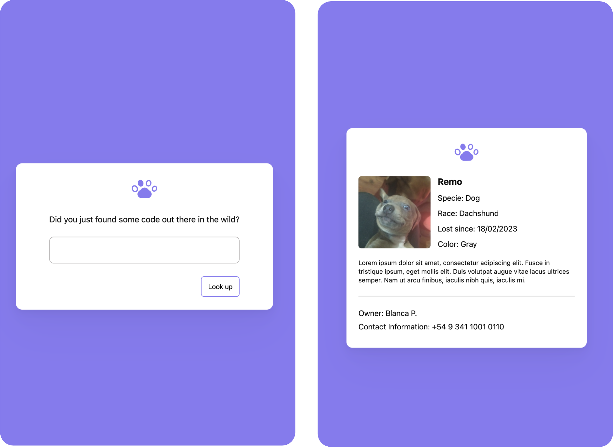

This is the website shown when someone scans your pet's code and its sent to the browser. Main responsability of this project is to call the backend to check if the code exists, and display the information the server returns in case it does.

Installation
```sh
yarn install
yarn run dev
```

Build
```
yarn run build
```
